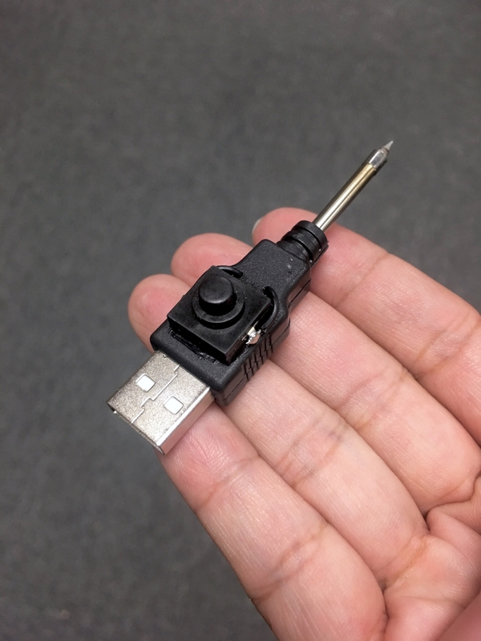

# Make Portable USB Soldering Iron

## 關於這篇文章

幾年前買了一個 USB 電烙鐵，大概 20 秒內就可以將焊錫融化。因為它的功率不大，所以只能用來焊接小東西。

最近看了很多自製電烙鐵的分享，所以也嘗試做了一個便攜版本的 USB 電烙鐵。供電的部分使用行動電源。這篇文章簡單記錄了我的學習和製作過程。

以結果來說成品不算完美（文章最後會提到所遭遇的問題）。整體來說雖然不適合長時間使用，但因為方便攜帶，作為應急之用應該是可以的。

## 了解烙鐵發熱原理

這是我之前買的 USB 電烙鐵，把加熱的烙鐵區拆開後發現其實結構很簡單。

上電後發現，烙鐵頭插槽裡面是正極，外面那一圈是負極。所以把那個螺帽拴緊固定烙鐵頭時，就會讓烙鐵頭的表面與負極（GND）接觸，而烙鐵頭尾端那一根應該就是接到正極（5V）。上電後可以把烙鐵頭視為一個電阻，因此會集中在烙鐵頭那發熱。

在網路上買了幾支 USB 電烙鐵專用的烙鐵頭來測試。常見的有兩種規格，我買的電烙鐵使用的是左邊那種，兩種只差在阻值有一點點差異。

為了驗證自己的猜測，用銅線簡單折了一個形狀，一邊接觸烙鐵頭表面，另一邊接觸烙鐵頭尾端的導線。

然後像這樣插入原本的電烙鐵中。

上電測試。

結果真的可以化錫。證明我的原理猜測應該是對的。

## 製作可攜 USB 電烙鐵

知道原理後，要怎麼做就會有概念了，原則上就是把正負極從烙鐵頭先以導線接出來，再接到行動電源 USB 接頭的 5V 和 GND 應該就可以加熱烙鐵頭了。

網路上有些分享是從＂烙鐵頭本身＂開始製作的。大致步驟是使用電熱絲綑綁一支磨過的銅棒，但...生命有限 XD 哈哈哈，那個太麻煩了。我這裡用的是偷懶的做法 -- 直接買 USB 電烙鐵專用的烙鐵頭。

因為要使用行動電源供電，所以我只使用這些材料。其中按鍵開關是鎖定式的，按下後就會鎖定狀態，直到下次按下解除。

稍微合一下，目前期望最後能長這樣，方便攜帶。但這邊就看到一個問題了，雖然實測時發現烙鐵頭的尾端溫度是不足以化錫的，但是傳導至尾端的溫度還是很高，這樣的安裝方式可能會將塑膠的部分融化。管他的，先做再說吧！

另一個小問題是，USB 接頭的外殼孔徑太小，這支烙鐵頭的直徑約 3.2mm，所以外殼需要擴孔。

用鑽孔機將走線孔擴大一點。至於烙鐵頭尾端發熱的問題，我想先用耐高溫膠帶擋一下試試看。所以若加上耐熱膠帶的厚度，孔還需要擴更大一點。

接出 GND 端。原本我想用銅線，但我手邊的銅線比較粗，怕最後會塞不進殼裡面。所以用單芯線纏繞烙鐵頭外殼幾圈後，準備焊接到 USB 的 GND。

纏幾圈耐高溫膠帶。

想到絕緣的問題，又把剛剛剝除的外皮套回去 XD 然後剪至適當長度。

然後跟 USB 的 GND（負極）接在一起。

正極要從烙鐵頭的尾端接出來，我本來想把線戳進去，然後用鉗子把後端的金屬壓扁，怎知根本壓不下去（還是我太弱 XD）所以最後還是用纏繞的。

因為 5V 的部分需要接一個開關來控制，所以將烙鐵頭的尾端和 USB 的 5V 腳位都以單芯線接出。

事先規劃一下按鍵開關的位置，想好樣怎麼走線後鑽孔。

像這樣把線穿出來再焊接到按鍵開關上。一般慣例正極都會用紅色的線，但因為配色會不好看，所以我還是用黑色。（好像星際大戰的競賽飛艇 XD

焊接完先測試一下，確定可以正常加熱後就可以固定在 USB 接頭外殼上了。

完成！！！！！！！

沙龍照（誤 XD

買了一支便宜的鋁合金外殼 18650 行動電源。裡面只有一顆 18650 電池和一個簡單的充放電路板。

合體！感覺蠻好看的（自己說 XD

有製作過的前輩分享說一顆 18650 用久了會發熱，用兩顆的比較不會。我還沒真的長時間試過，不過要換也是很簡單的，直接抽換就好。

換了稍微扁形的行動電源，握感還可以。看了這張圖就知道，還是買鋁合金外殼的吧！比較帥（哈哈）。

打完，收工！

## 測試電烙鐵

[測試影片](images/solder-iron-heating.mp4)（點擊下圖觀看）：差不多 20 秒內可以化錫。

使用時最高功耗約 5.8W。

## 遭遇問題 -- 烙鐵頭尾端過熱

試著讓烙鐵燒一陣子，結果烙鐵頭尾端還是將塑膠熔掉了！QQ

如果不能像原始的 USB 電烙鐵那樣透過螺帽卡住烙鐵頭，或許應該還是要讓整個烙鐵頭外露。有時間再想想怎麼改進或改版吧！整體而言，還是個很好玩的下班後專案 :)

~ END ~